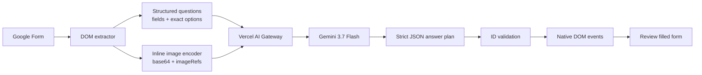

<div align="center">
  
  <h1>AI Gateway for Google Forms</h1>
  <p><strong>One prompt. Every question. A fully filled Google Form.</strong></p>
  <p>A privacy-conscious Chrome extension that understands complete Google Forms—including images and grids—and fills practice quizzes with multimodal AI.</p>
  <p>
    
    
    
    
  </p>
</div>

---

## Why AI Gateway?

Most form assistants process one field at a time and lose the context connecting questions, answer choices, grids, and diagrams. AI Gateway takes the opposite approach: it extracts the entire form, builds one structured multimodal request, and applies one validated answer plan back to the page.

- **Whole-form reasoning** — every supported question is included in a single prompt.
- **Real vision input** — images are downloaded and embedded as inline base64 payloads, so providers never need to crawl Google-hosted URLs.
- **Exact option matching** — radio, checkbox, dropdown, and grid responses must match labels present in the form.
- **Humanized writing** — subjective responses are concise, natural, and configurable.
- **No surprise submission** — answers are filled for review; the extension never presses Submit.
- **Zero build step** — plain Manifest V3, HTML, CSS, and JavaScript.

## Supported question types

| Google Forms field | Support | Behavior |
|---|:---:|---|
| Short answer | ✅ | Direct, natural response |
| Paragraph | ✅ | Human-sounding long-form response |
| Multiple choice | ✅ | Selects one exact option |
| Checkboxes | ✅ | Selects all matching answers |
| Dropdown | ✅ | Opens and selects an exact option |
| Linear scale | ✅ | Treated as a single-choice scale |
| Multiple-choice grid | ✅ | Solves each row independently |
| Checkbox grid | ✅ | Solves each row independently |
| Date, time, and number | ✅ | Uses the field's required format |
| Question/form images | ✅ | Supports multiple images per question |
| File upload | — | Detected and intentionally skipped |

## How it works



1. The content script identifies top-level Google Forms questions and their interactive controls.
2. Every field receives a stable request-local ID. Choice labels are preserved verbatim.
3. Up to 20 images by default are downloaded, optimized when necessary, and attached inline with exact `imageRefs`.
4. Vercel AI Gateway sends one structured multimodal request to `google/gemini-3.7-flash` using automatic provider routing.
5. The response must satisfy a strict JSON schema. Unknown field IDs are discarded.
6. The extension fills controls with native setters, click events, and input/change events Google Forms understands.

## Install locally

> AI Gateway is currently distributed as an unpacked Chrome extension.

1. Download or clone this repository.
2. Open `chrome://extensions` in Chrome.
3. Enable **Developer mode**.
4. Click **Load unpacked**.
5. Select the repository root—the directory containing `manifest.json`.
6. Open the extension's **Settings** and add a Vercel AI Gateway API key.

```bash
git clone https://github.com/Kushalkhemka/ai-gateway-google-forms.git
```

After pulling an update, click **Reload** on the extension card and refresh any already-open Google Form tabs.

## Usage

1. Open the respondent view of a Google Form.
2. Click the **AI Gateway** toolbar icon and select **Autofill form**.
3. Or press **Ctrl+Enter** on Windows/Linux and **Command+Enter** or **Control+Enter** on macOS.
4. Wait for the toolbar icon to return to its normal state.
5. Review every response before submitting manually.

The page remains visually clean during processing—no overlay or toast is injected into the form.

## Configuration

Settings are stored in `chrome.storage.local` and are never committed to the repository.

| Setting | Default | Notes |
|---|---|---|
| Model | `google/gemini-3.7-flash` | Vision-capable model through Vercel AI Gateway |
| Maximum images | `20` | Configurable from 10–30 |
| Answer style | Natural student response | Customize tone and answer depth |

### Request shape

The gateway receives:

- Form title and description
- Ordered questions and stable field IDs
- Field types and exact allowed options
- Question-to-image reference mappings
- Inline `data:image/...;base64,...` image attachments
- A strict JSON response schema

No Google Form URL or Google-hosted image URL is sent for the model provider to crawl.

## Privacy and security

- Your Vercel AI Gateway key stays in local Chrome extension storage.
- Form content leaves the browser only when you explicitly invoke autofill.
- Requests go directly from the extension to Vercel AI Gateway.
- Automatic provider routing improves availability during provider-specific outages.
- The extension does not collect analytics, run a backend, or auto-submit forms.
- Form text is treated as untrusted content and cannot change the response contract or request secrets.

Review [SECURITY.md](SECURITY.md) before reporting a vulnerability publicly.

## Development

No compilation or dependency installation is required.

```bash
npm test
```

The self-test verifies:

- Manifest V3 configuration
- JavaScript syntax
- Supported question-type markers
- Multimodal inline-image handling
- Automatic gateway routing
- Keyboard shortcut listeners
- Absence of committed API keys

### Project structure

```text
.
├── background.js        # Gateway request, schema, image encoding, toolbar state
├── content.js           # Google Forms extraction, keyboard shortcut, DOM autofill
├── popup.*              # Compact extension action UI
├── options.*            # Local settings UI
├── icons/               # Runtime extension icons (Vercel integration)
├── assets/              # Repository-only original branding
├── tests/selftest.mjs   # Zero-dependency validation
└── manifest.json        # Chrome Manifest V3 definition
```

## Reliability notes

- Vercel AI Gateway chooses an available provider automatically.
- Transient HTTP `502`, `503`, and `504` responses receive one delayed retry.
- Images are resized only when large and encoded inline to avoid provider crawler restrictions.
- Answers are mapped through generated IDs rather than question text, preventing collisions between similar questions.

## Scope and responsible use

AI Gateway is designed for practice quizzes, self-study, QA, and form-automation experiments. Do not use it to violate academic-integrity rules, assessment policies, privacy requirements, or the terms of forms you do not own.

Model-generated answers can be wrong. Always review the completed form before submitting it.

## Contributing

Issues and pull requests are welcome. See [CONTRIBUTING.md](CONTRIBUTING.md) for setup, testing, and contribution expectations.

---

<div align="center">
  <sub>Built for fast practice, careful review, and a clean Google Forms experience.</sub>
</div>
