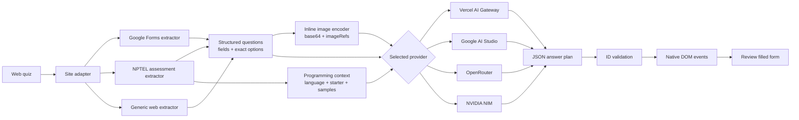

<div align="center">
  
  <h1>AI Gateway for Web Quizzes</h1>
  <p><strong>One prompt. Every question. A review-ready assessment.</strong></p>
  <p>A privacy-conscious Chrome extension that understands MCQ forms across the web, with specialized support for Google Forms and NPTEL—including images, grids, subjective answers, and programming problems.</p>
  <p>
    
    
    
    
    
  </p>
</div>

---

## Why AI Gateway?

Most assessment assistants process one field at a time and lose the context connecting questions, answer choices, scenarios, code, and diagrams. AI Gateway takes the opposite approach: it extracts the entire supported assessment, builds one structured multimodal request, and applies one validated answer plan back to the page.

- **Whole-form reasoning** — every supported question is included in a single prompt.
- **Works across the web** — detects ordinary native and ARIA-based quiz controls on HTTP and HTTPS pages.
- **Real vision input** — images are downloaded and embedded as inline base64 payloads, so providers never need to crawl Google-hosted URLs.
- **Provider choice** — use Vercel AI Gateway, Google AI Studio, OpenRouter, or NVIDIA NIM with separate locally stored keys.
- **Vision-only model selector** — live provider catalogs are filtered for image input and text output, with a conservative verified fallback list.
- **Exact option matching** — radio, checkbox, dropdown, and grid responses must match labels present in the form.
- **Humanized writing** — subjective responses are concise, natural, and configurable.
- **Programming support** — NPTEL problem statements, selected language, starter code, constraints, and samples are solved as one complete source file.
- **Clipboard compatibility** — restores selection, copy, paste, cut, and right-click throughout NPTEL without disabling Ace editor controls.
- **No surprise submission** — answers are filled for review; the extension never presses Submit.
- **Zero build step** — plain Manifest V3, HTML, CSS, and JavaScript.

## Supported platforms and question types

| Platform | Page type | Support |
|---|---|:---:|
| Google Forms | Public/respondent forms | ✅ |
| General websites | Native/ARIA radio, checkbox, select, and related answer fields | ✅ |
| NPTEL | Text selection, copy/paste, and right-click on course pages | ✅ |
| NPTEL/SWAYAM | MCQ, MSQ, numerical, short answer, essay | ✅ |
| NPTEL/SWAYAM | Programming assignments with Ace Editor | ✅ |

| Field | Support | Behavior |
|---|:---:|---|
| Short answer | ✅ | Direct, natural response |
| Paragraph | ✅ | Human-sounding long-form response |
| Multiple choice | ✅ | Selects one exact option |
| Checkboxes | ✅ | Selects all matching answers |
| Dropdown | ✅ | Opens and selects an exact option |
| Linear scale | ✅ | Treated as a single-choice scale |
| Multiple-choice grid | ✅ | Solves each row independently |
| Checkbox grid | ✅ | Solves each row independently |
| Date, time, and number | ✅ | Uses the field's required format |
| Question/form images | ✅ | Supports multiple images per question |
| Programming editor | ✅ | Writes complete code in the language selected by NPTEL |
| File upload | — | Detected and intentionally skipped |

## How it works



1. The content script selects Google Forms, NPTEL, or generic web extraction; specialized adapters take priority.
2. Every field receives a stable request-local ID. Choice labels are preserved verbatim.
3. Up to 20 images by default are downloaded, optimized when necessary, and attached inline with exact `imageRefs`.
4. The selected provider sends one multimodal request using the model selected in Settings. Vercel uses its strict JSON-schema mode; direct providers receive the same explicit output contract in the prompt.
5. The answer plan is parsed and unknown field IDs are discarded.
6. The extension fills native controls and Ace Editor while leaving every submit/compile action to the user.

On general websites, AI Gateway activates only when the page contains a credible MCQ group: at least two visible radio choices or a grouped set of checkboxes. On NPTEL pages, a compatibility script additionally prevents page-level clipboard blockers while preserving element-level listeners and ordinary keyboard handling.

## Install locally

> AI Gateway is currently distributed as an unpacked Chrome extension.

1. Download or clone this repository.
2. Open `chrome://extensions` in Chrome.
3. Enable **Developer mode**.
4. Click **Load unpacked**.
5. Select the repository root—the directory containing `manifest.json`.
6. Open the extension's **Settings**, choose a provider, add its API key, and select a vision-capable model.

```bash
git clone https://github.com/Kushalkhemka/ai-gateway-google-forms.git
```

After pulling an update, click **Reload** on the extension card, approve the broader website permission, and refresh any already-open quiz tabs.

## Usage

1. Open a web quiz, Google Form respondent page, or supported NPTEL assessment.
2. Click the **AI Gateway** toolbar icon and select **Autofill quiz**.
3. Or press **Ctrl+Enter** on Windows/Linux and **Command+Enter** or **Control+Enter** on macOS.
4. Wait for the toolbar icon to return to its normal state.
5. Review every response before submitting manually.

The page remains visually clean during processing—no overlay or toast is injected into the form.

## Configuration

Settings are stored in `chrome.storage.local` and are never committed to the repository.

| Setting | Default | Notes |
|---|---|---|
| Provider | Vercel AI Gateway | Also supports Google AI Studio, OpenRouter, and NVIDIA NIM |
| Model | `google/gemini-3.7-flash` | Selector contains only verified image-input/text-output models |
| Maximum images | `20` | Configurable from 10–30 |
| Answer style | Natural student response | Customize tone and answer depth |

Each provider has its own saved key and last-selected model. **Refresh models** retrieves the live catalog; if a key is missing or discovery is unavailable, the page clearly labels and uses a small verified fallback list.

### Request shape

The gateway receives:

- Form title and description
- Ordered questions and stable field IDs
- Field types and exact allowed options
- Question-to-image reference mappings
- Inline `data:image/...;base64,...` image attachments
- A strict JSON response schema

No assessment URL or externally hosted image URL is sent for the model provider to crawl.

## Privacy and security

- Provider API keys stay in local Chrome extension storage and are never committed to this repository.
- Form content leaves the browser only when you explicitly invoke autofill.
- Requests go directly to the provider selected in Settings. Vercel AI Gateway can automatically route between upstream providers; the three direct options do not.
- The extension does not collect analytics, run a backend, or auto-submit forms.
- Form text is treated as untrusted content and cannot change the response contract or request secrets.
- General website support requires Chrome's **read and change data on all websites** permission so the content script can inspect quiz controls and retrieve cross-origin question images. It performs no extraction or AI request until you explicitly invoke Autofill.

Review [SECURITY.md](SECURITY.md) before reporting a vulnerability publicly.

## Development

No compilation or dependency installation is required.

```bash
npm test
```

The self-test verifies:

- Manifest V3 configuration
- JavaScript syntax
- Supported question-type markers
- Multimodal inline-image handling
- Provider adapters and vision-only catalog filtering
- Keyboard shortcut listeners
- Absence of committed API keys

### Project structure

```text
.
├── background.js        # Provider requests, schema, image encoding, toolbar state
├── provider-config.js   # Provider endpoints, model filters, catalog fallbacks
├── content.js           # Site adapters, keyboard shortcut, native/Ace autofill
├── nptel-clipboard.js   # Early NPTEL selection and clipboard compatibility
├── popup.*              # Compact extension action UI
├── options.*            # Local settings UI
├── icons/               # Runtime extension icons (Vercel integration)
├── assets/              # Repository-only original branding
├── tests/selftest.mjs   # Zero-dependency validation
└── manifest.json        # Chrome Manifest V3 definition
```

## Reliability notes

- Vercel AI Gateway chooses an available upstream provider automatically; direct providers give you explicit routing and billing control.
- Live catalogs are treated conservatively: models without positive evidence of image input are hidden.
- Transient HTTP `502`, `503`, and `504` responses receive one delayed retry.
- Images are resized only when large and encoded inline to avoid provider crawler restrictions.
- Answers are mapped through generated IDs rather than question text, preventing collisions between similar questions.

## Scope and responsible use

AI Gateway is designed for practice quizzes, self-study, QA, and assessment-automation experiments. Do not use it to violate academic-integrity rules, assessment policies, privacy requirements, or the terms of assessments you do not own.

Model-generated answers can be wrong. Always review the completed form before submitting it.

## Contributing

Issues and pull requests are welcome. See [CONTRIBUTING.md](CONTRIBUTING.md) for setup, testing, and contribution expectations.

## Acknowledgements

The NPTEL clipboard compatibility approach was informed by [agrim-rai/unNPTEL](https://github.com/agrim-rai/unNPTEL). Provider normalization patterns were informed by [tashfeenahmed/freellmapi](https://github.com/tashfeenahmed/freellmapi). AI Gateway uses independently scoped implementations and official provider APIs.

---

<div align="center">
  <sub>Built for fast practice, careful review, and clean assessment workflows.</sub>
</div>
